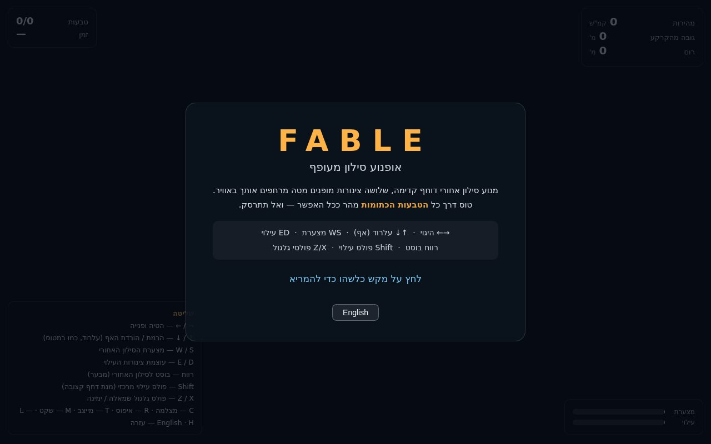
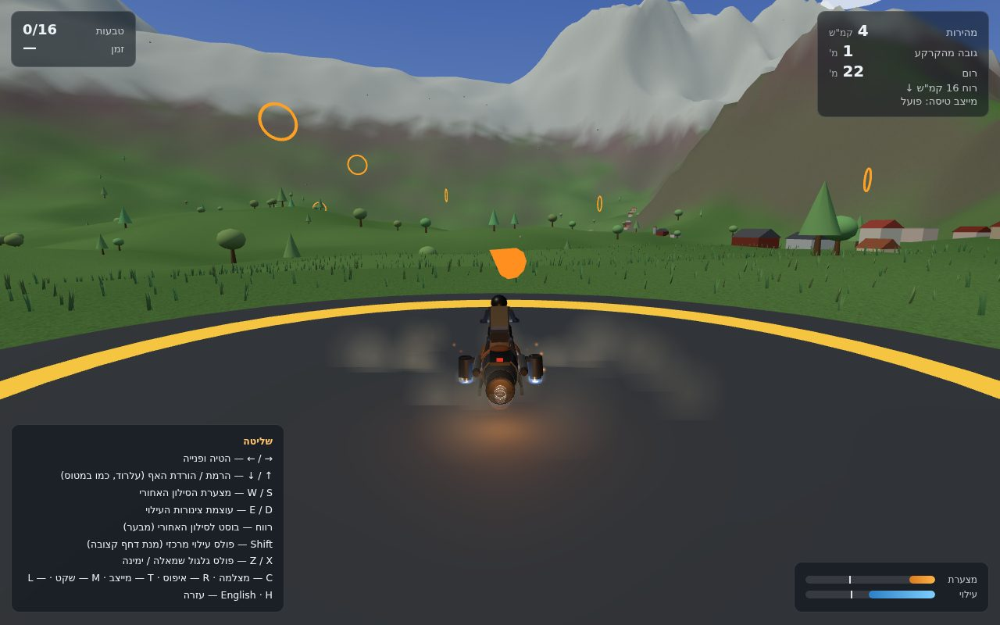
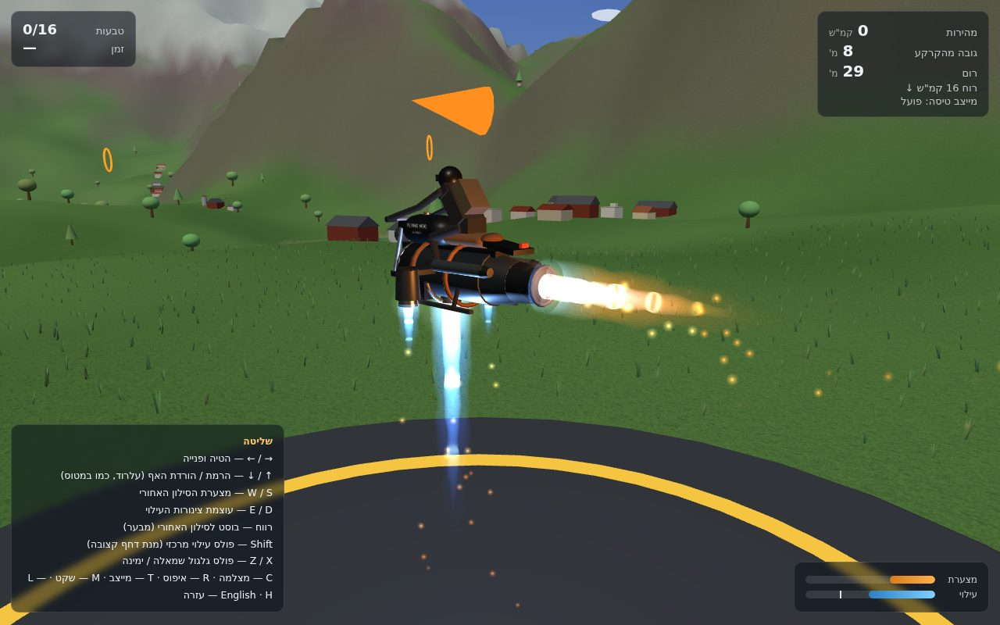
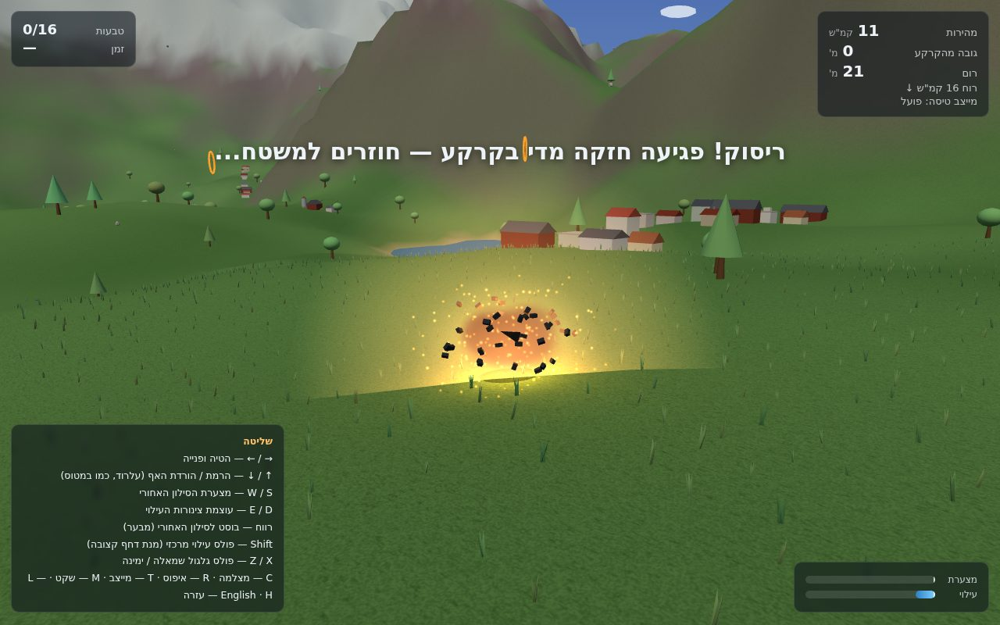

# FABLE — Flying Jet Bike

**[▶ Play it live](https://orimosenzon.github.io/fun/vibe_coding/fable)** — nothing to install, just a browser.

A browser-based 3D flight game: you ride a jet-powered motorcycle — the *FLYING HOG / ALPINIST* — through a procedurally generated landscape of mountains, valleys, forests, villages and lakes, racing through 16 glowing rings as fast as possible. The whole thing is built on a from-scratch 6-degrees-of-freedom rigid-body flight model, not a canned physics engine — the project's actual centerpiece is *how it flies*, not just what it looks like.

| Start screen | In flight (chase cam) |
|---|---|
|  |  |

| Close-up on the bike | Crash |
|---|---|
|  |  |

---

## Table of contents

- [What this is](#what-this-is)
- [Quick start](#quick-start)
- [Controls](#controls)
- [Debug / URL flags](#debug--url-flags)
- [Architecture](#architecture)
- [The physics model](#the-physics-model-physicsjs--windjs)
- [File-by-file guide](#file-by-file-guide)
- [Tests](#tests)
- [Deployment](#deployment)
- [Known gaps / ideas for next steps](#known-gaps--ideas-for-next-steps)

---

## What this is

FABLE is a single-page, no-build, no-backend 3D game. You throttle up a jet bike, lift off, and fly through a 4 km × 4 km procedural world, threading 16 rings as quickly as you can before the course loops. It supports **desktop (keyboard) and mobile (touch)** input, and a **full Hebrew/English UI** (Hebrew is the default, matching the author's primary language).

The project's real focus is the flight model: a proper 6DOF rigid body driven by actual forces and torques (thrust, drag, lift, gravity, gyroscopic coupling), integrated with an exact exponential-map rotation update instead of naive Euler stepping — so angular momentum is conserved to a very tight tolerance. On top of that sits a modern fly-by-wire control law (you command a turn *rate*, not a bank angle) and a real MIL-F-8785C Dryden turbulence model for the wind, the same math used in flight-simulator and aircraft-handling literature. It is unusually rigorous for a browser toy, and that rigor is checked by an actual headless test suite (34 tests), not just eyeballing it.

## Quick start

No build step, no `npm install` for the game itself — it's plain ES modules loaded straight from `index.html`, with [Three.js](https://threejs.org/) pulled from a CDN via an import map.

```bash
cd fable
python3 -m http.server 8791
```

Then open **http://localhost:8791/**. Any static file server works equally well (the `python3 -m http.server` above is just the simplest).

> Requires a reasonably modern browser with WebGL2 and Web Audio support. No API keys, no accounts, no server-side anything.

## Controls

**Keyboard (desktop):**

| Key(s) | Action |
|---|---|
| `←` / `→` | Steer (fly-by-wire: commands turn *rate*, the controller banks automatically) |
| `↓` / `↑` | Pitch (airplane-yoke convention — **down = nose up**) |
| `W` / `S` | Throttle (rear jet) up / down |
| `E` / `D` | Collective (lift jets) up / down |
| `Space` | Rear afterburner boost |
| `Shift` | RCS pulse — center (down) nozzle |
| `Z` / `X` | RCS pulse — left / right nozzle (roll) |
| `C` | Toggle camera (chase / onboard) |
| `R` | Reset / respawn |
| `T` | Toggle flight assist |
| `M` | Mute |
| `L` | Toggle language (Hebrew ⇄ English) |
| `H` | Toggle help panel |

**Touch (mobile):** left-side virtual joystick (steer + pitch), right-side hold-buttons for throttle/collective, a big red boost button, three small pulse buttons, and a top menu for camera/assist/reset/mute/help/language. Touch mode is auto-detected via `matchMedia('(pointer: coarse)')`, or forced with `?touch=1`.

## Debug / URL flags

These are query-string flags on `index.html`, mainly used for visual debugging and headless smoke-testing (no code changes needed):

| Flag | Effect |
|---|---|
| `?demo` | Auto-starts the game and flies on autopilot — for headless screenshots/smoke tests |
| `?pose=cruise` | Spawns mid-air at cruising speed with full afterburner |
| `?pose=show` | Bike pinned in mid-air with every effect firing — used for the close-up screenshot above |
| `?pose=boom` | Drops the bike straight into the ground on frame one, to show off the crash FX |
| `?pose=horses` / `?pose=birds` | Debug camera parked on the first horse herd / bird flock |
| `?touch=1` | Forces mobile touch controls on a desktop browser |
| `?lang=he` / `?lang=en` | Force UI language |
| `?selftest=touch` | Headless check that touch controls actually move the physics state (drives synthetic pointer events and stamps results into `document.body.dataset`) |

## Architecture

No framework, no bundler, no package manager for the game itself — just ES modules imported directly by the browser, wired together in `js/main.js`. The only external dependency is Three.js 0.160, resolved via an `importmap` in `index.html` pointing at a CDN:

```
index.html
  └─ js/main.js         orchestrates everything: render loop, input, camera, rings, HUD wiring
       ├─ world.js       terrain / water / villages / forests / rings / sky (shared with physics!)
       ├─ bike.js        the bike + rider mesh
       ├─ physics.js     the 6DOF rigid-body flight model
       ├─ wind.js        Dryden turbulence + ridge lift (feeds physics.js)
       ├─ jetfx.js       exhaust plumes, sparks, ground dust
       ├─ explosion.js   crash fireball / debris / water-impact spray
       ├─ grass.js       instanced grass disc that follows the player
       ├─ animals.js     horse herds + bird flocks (living scenery)
       ├─ hud.js         DOM overlay (stats, bars, messages, start screen)
       ├─ i18n.js        Hebrew/English string table
       ├─ audio.js       procedural jet engine sound (Web Audio, no sample files)
       ├─ touch.js       mobile virtual joystick + buttons
       └─ noise.js       seeded PRNG + simplex noise (shared by terrain *and* physics)
```

The important architectural rule: **`world.js`'s `terrainHeight()` and `noise.js`'s PRNG are shared, unmodified, between the renderer and the physics step.** The ground the bike collides with is exactly the ground you see — there is no separate collision mesh to keep in sync, and it's why `tests/` copies these files verbatim rather than mocking them (see [Tests](#tests)).

## The physics model (`physics.js` + `wind.js`)

This is the part of the codebase worth actually reading if you want to understand the project.

- **Rigid body, 6 degrees of freedom.** Position + velocity in world space; orientation as a quaternion; angular momentum `L = Iω` kept in the *body* frame and evolved via Euler's rigid-body equations, including the gyroscopic `ω × Iω` term. The rotation update uses the **exact exponential map**, not a first-order Euler step — angular momentum drifts by less than 0.02° over half a second of free rotation, which the test suite checks directly.
- **Body-frame convention — read this before touching the code:** `Y` = up, `Z` = forward. In this right-handed setup, body **`+X` is the rider's *left*** (not their right) — the opposite of the naive intuition, and a bug that shipped once already. It's documented at the top of `physics.js` for exactly that reason.
- **Fly-by-wire steering.** The stick commands a *turn rate*, not a fixed bank angle; the flight controller derives the bank angle from coordinated-turn geometry (`φ = atan(V·ω / g)`), so steering feels consistent at any speed instead of getting twitchier as you slow down.
- **Thrust vectoring.** The rear nozzle yaws up to ±15° through a first-order actuator model (`τ = 0.15s`), giving pitch authority even while hovering, whenever there's throttle.
- **Extended roll authority.** Roll (aileron) travel is ±60° (was ±33° in an earlier iteration); a weathervane term yields authority back to the pilot proportional to how hard they're commanding it.
- **RCS-style pulses** (`Z` / `X` / `Shift`) fire a fixed impulse — 0.12s burn + 0.10s refractory gap — on the side/center downward nozzles, modeled on spacecraft reaction-control thrusters rather than a sustained force.
- **Turbine spool dynamics.** Throttle and collective are *commands*; actual thrust (`spoolRear` / `spoolLift`) chases the command through a first-order ODE (0.8s spool-up / 0.5s spool-down on the main engine, faster on the afterburner and lift jets). The HUD throttle/lift bars show both: a fill for actual thrust, a line marker for the commanded value.
- **Gyroscopic coupling.** The spinning turbine rotor itself carries angular momentum; at high throttle this couples roll and yaw through an `ω × h` torque — a rolling input causes an involuntary bit of yaw, just like a real turbine bike would. Angular-momentum conservation is tested including *both* the airframe and the rotor together.
- **Real atmospheric turbulence (`wind.js`, deliberately dependency-free/Node-safe).** A prevailing wind vector plus true **MIL-F-8785C Dryden turbulence**: a first-order shaping filter for the along-wind component, second-order filters for cross-wind and vertical components, driven by Gaussian noise — plus ridge lift, where flying along a windward mountain slope produces real updraft. All aerodynamics act on *airspeed* (velocity relative to the moving air), so hovering drifts downwind and the nose weathervanes into the wind.
- **Ground handling:** spring-damper + friction on contact; a crash is triggered by vertical impact speed, by flipping over, or by hitting water — encoded as reason codes (`'water'` / `'ground'` / `'flip'`), never translated strings, so `i18n.js` can localize the crash message.
- **Everything tunable lives in one place:** the `TUNE` object at the top of `physics.js` (masses, thrust limits, drag areas, spool time constants, turn-rate limits, etc.) — that's the first place to look to change how the bike *feels*.

## File-by-file guide

| File | Lines | Responsibility |
|---|---:|---|
| `index.html` | ~120 | Page shell, all CSS (HUD/touch/start-screen styling), import map, global error banner |
| `js/main.js` | ~440 | Render loop, input handling (keyboard + touch), camera modes, ring/scoring logic, wires every module together |
| `js/physics.js` | ~385 | The 6DOF flight model described above; `TUNE` constants live here |
| `js/wind.js` | ~85 | Dryden turbulence + ridge lift; pure math, no DOM — importable from Node for tests |
| `js/world.js` | ~610 | Procedural terrain (`terrainHeight`, shared with physics), water, villages, forests, the 16-ring course, sky/clouds |
| `js/bike.js` | ~155 | Builds the bike + rider Three.js mesh (procedural geometry + canvas-drawn tank texture) |
| `js/jetfx.js` | ~370 | Shader-based exhaust plumes (mach diamonds, afterburner glow), ember sparks, ground dust, dynamic lights |
| `js/explosion.js` | ~260 | Crash fireball, ballistic debris, smoke, camera shake; a weaker water-splash variant |
| `js/grass.js` | ~125 | Instanced grass disc around the player, deterministically placed on a world grid so it doesn't crawl |
| `js/animals.js` | ~260 | Horse herds (graze/amble state machine) and bird flocks (flap/glide), all `InstancedMesh` |
| `js/hud.js` | ~120 | DOM overlay: stats, throttle/lift bars, ring counter, messages, start screen, help panel |
| `js/i18n.js` | ~120 | Hebrew (default) / English string table, persisted in `localStorage` |
| `js/audio.js` | ~125 | Procedural jet sound — filtered noise (rumble) + oscillator (turbine whine), no audio files |
| `js/touch.js` | ~120 | Mobile virtual joystick + hold-buttons, built on Pointer Events |
| `js/noise.js` | ~50 | Seeded PRNG (`mulberry32`) + 2D simplex noise — shared by terrain generation *and* physics ground collision |

Everything is plain, dependency-free JS/ES modules except for Three.js. Nothing here needs a bundler, transpiler, or `node_modules` to run the game itself — only the test suite (see below) installs anything.

## Tests

`tests/simtest.js` is a **headless** test suite (plain Node, no browser, no test framework) covering 34 physics behaviors: resting on the ground, hovering, top cruise speed, fly-by-wire turn-rate independence from airspeed, thrust-vector authority while hovering, RCS pulse accuracy (impulse size, frame-rate independence, refractory-gap enforcement), the ±60° roll range, turbine spool curves, gyroscopic coupling and combined-body angular-momentum conservation, Dryden turbulence sanity (bounded, zero-mean, plausible magnitude), wind drift, crash/respawn, 60-second numerical stability, and classical momentum conservation in free tumbling.

It works by importing the *actual* game source — `physics.js`, `world.js`, `noise.js`, `wind.js` — copied verbatim into `tests/` (see `tests/.gitignore`) rather than reimplemented or mocked, so a passing suite means the exact code that ships is what got tested:

```bash
cd tests
echo '{"type":"module"}' > package.json   # already committed, shown for clarity
npm install three@0.160.0
cp ../js/{physics,world,noise,wind}.js .
node simtest.js
```

Tests zero out `TUNE.windSpeed` for a calm, deterministic baseline; the wind-specific tests turn it back on locally. See `tests/README.md` for the from-scratch version of these steps.

## Deployment

Static hosting on **GitHub Pages via GitHub Actions** (`.github/workflows/pages.yml`), not the legacy Jekyll-based Pages build — that was switched over after the old build started failing consistently. Every push to `master` triggers the workflow, which uploads the whole repo tree as a Pages artifact and deploys it — typically live within seconds, no build step of its own since the game needs none.

Live at: **https://orimosenzon.github.io/fun/vibe_coding/fable**

## Known gaps / ideas for next steps

Deliberately not implemented (either not gotten to yet, or explicitly deferred after discussion):

- **Collision with trees/buildings** — currently you can fly straight through them; the only real "physical" gap left, since ground/water/flip crashes are already handled and dramatic.
- **High-score persistence** — best ring-course time is only kept in memory for the current tab session, not `localStorage`.
- Additional / harder ring courses.
- Vortex Ring State (a real helicopter/VTOL hazard on steep vertical descent) — considered and explicitly deferred, not rejected outright.
- Boost/fuel budget — deliberately rejected; boosts are unlimited by design.
