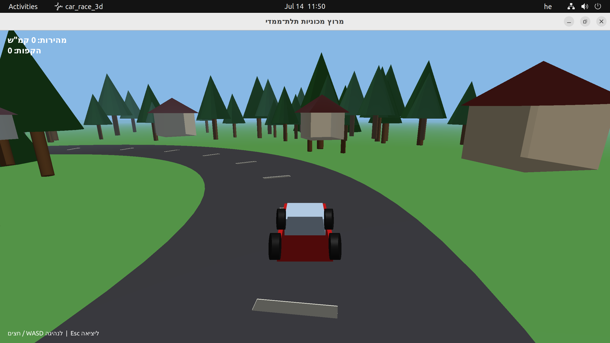

# מרוץ מכוניות תלת־ממדי

משחק תלת־ממדי ב-C++ עם Qt6 + OpenGL: מכונית נוסעת על מסלול מעגלי, מוקפת עצים ובתים. נבנה כולו מפרומפט בודד — ראו [PROMPT.md](PROMPT.md).



## הרצה

```bash
mkdir -p build && cd build
cmake -DCMAKE_BUILD_TYPE=Release ..
make -j$(nproc)
./car_race_3d
```

דורש Qt6 (Core, Gui, Widgets, OpenGL, OpenGLWidgets) ו-CMake ≥ 3.16.

## שליטה

- **חצים / WASD** — נהיגה (האצה, בלימה/נסיעה אחורה, פנייה)
- **Esc** — יציאה

## מה יש בסצנה

- מסלול מעגלי (טבעת אספלט עם קו הפרדה מקווקו)
- כ-90 עצים (גזע + עלווה) פזורים סביב המסלול ובאמצע
- 10 בתים (גוף + גג פירמידה) מסביב לשטח
- מצלמה שעוקבת מאחורי המכונית, תאורה כיוונית + ערפל מרחק
- מונה מהירות והקפות ב-HUD

## מבנה קוד

- `src/Mesh.h/.cpp` — יצירת גאומטריה פרוצדורלית (קובייה, גליל, קונוס, מישור, טבעת)
- `src/GameView.h/.cpp` — לוגיקת המשחק: פיזיקת נהיגה, מצלמה, שיידרים, ציור הסצנה
- `src/MainWindow.h/.cpp`, `src/main.cpp` — חלון Qt וכניסה לתוכנית
